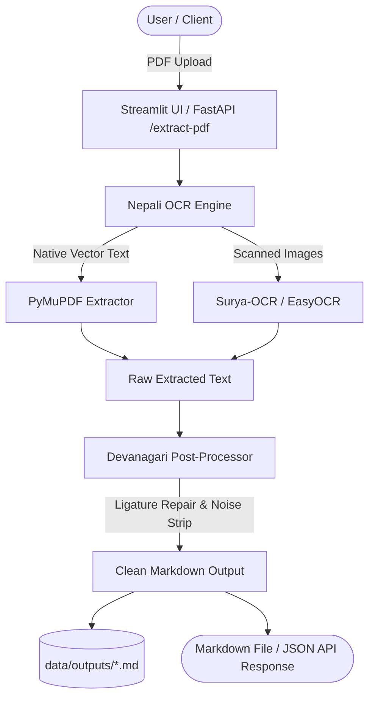

# 🇳🇵 Automated PDF Devanagari/Nepali Text Extractor

A modular, production-ready **Devanagari/Nepali PDF Text Extractor & Post-Processor** powered by **Surya-OCR**, **EasyOCR**, **PyMuPDF**, **FastAPI**, and **Streamlit**.

---

## 🌟 Key Features

1. **FastAPI File Upload API (`/extract-pdf`)**:
   - High-performance REST endpoint accepting multi-page PDF documents.
   - Configurable engine selection (`auto`, `surya`, `easyocr`, `native`).
   - Automated cleanup of temporary uploads and instant `.md` download endpoints.

2. **Advanced Devanagari Post-Processing Pipeline**:
   - **Noise Reduction**: Strips OCR artifacts, broken symbols, and non-printable control characters.
   - **Ligature & Joint Character Repair**: Automatically joins broken Devanagari ligatures (e.g. `क ् त` ➔ `क्त`, `श ् र` ➔ `श्र`, `त ् र` ➔ `त्र`, `क ् ष` ➔ `क्ष`).
   - **Matra & Halant Normalization**: Fixes misplaced spaces between consonants and vowel signs (Matras).
   - **Purna Viram Formatting**: Normalizes vertical pipes (`|`) to Devanagari Purna Viram (`।`).
   - **Auto-Markdown Generation**: Formats titles into `# Headings`, converts Devanagari/English lists (`१.`, `1.`), and outputs clean `.md` files.

3. **Streamlit Split-Screen UI**:
   - Left side: PDF page preview renderer.
   - Right side: Formatted Devanagari Markdown preview with tabs for raw text, statistics, and 1-click `.md` download.

---

## 🏗️ Project Architecture



---

## 📂 Project Structure

```
NepaliOCR/
├── venv/                      # Python Virtual Environment
├── app/
│   ├── __init__.py            # App package
│   ├── config.py              # System configuration & paths
│   ├── ocr_engine.py          # Unified OCR Engine (Surya, EasyOCR, PyMuPDF)
│   ├── postprocessor.py       # Devanagari Regex Post-Processor & Markdown Converter
│   ├── api.py                 # FastAPI Web API (/extract-pdf, /download)
│   └── ui.py                  # Streamlit Side-by-Side UI
├── data/
│   ├── uploads/               # Temporary uploaded PDF storage
│   └── outputs/               # Generated Markdown (.md) files
├── sample_docs/
│   └── generate_sample_nepali_pdf.py # Sample Devanagari PDF Generator
├── tests/
│   └── test_postprocessor.py  # Unit tests for Devanagari post-processing
├── main.py                    # Unified CLI launcher
├── run.bat / run.ps1          # One-click Windows Launchers
├── requirements.txt           # Dependency requirements
└── README.md                  # Project Documentation
```

---

## 🚀 Quick Start Guide

### 1. Environment Setup

```bash
# Create Virtual Environment
python -m venv venv

# Activate Virtual Environment (Windows PowerShell)
.\venv\Scripts\Activate.ps1

# Install Dependencies
pip install -r requirements.txt
```

### 2. Start Streamlit UI

```bash
python main.py ui
```
Open [http://localhost:8501](http://localhost:8501) in your browser.

### 3. Start FastAPI Server

```bash
python main.py api
```
Access Swagger API Docs at [http://127.0.0.1:8000/docs](http://127.0.0.1:8000/docs).

---

## 📡 API Reference (`/extract-pdf`)

### `POST /extract-pdf`
Upload a PDF document to extract Devanagari text and receive clean Markdown.

#### Request Parameters (Multipart Form / Query):
- `file` (File, Required): PDF document.
- `engine` (Query, Optional): `auto` | `surya` | `easyocr` | `native` (Default: `auto`).
- `fix_ligatures` (Query, Optional): `true` | `false` (Default: `true`).
- `strip_noise` (Query, Optional): `true` | `false` (Default: `true`).

#### Example Response:
```json
{
  "success": true,
  "filename": "sample_document.pdf",
  "engine_used": "easyocr",
  "page_count": 1,
  "elapsed_seconds": 1.45,
  "markdown_filename": "extracted_a1b2c3d4.md",
  "download_url": "/download/extracted_a1b2c3d4.md",
  "stats": {
    "original_char_count": 480,
    "cleaned_char_count": 472,
    "devanagari_char_count": 412,
    "noise_removed_chars": 8
  },
  "markdown_content": "# नेपाल सरकार\n\n1. पहिलो बुँदा\n2. दोस्रो बुँदा"
}
```

---

## 🧪 Running Unit Tests

To run the Devanagari regex cleaning & post-processor test suite:

```bash
python main.py test
```

---

## 📜 License
MIT License. Built for Devanagari & Nepali Document Digitization.

- July feature update

- July engine update

- July config tuning

- August API setup

- August model evaluation

- August UI testing

- August postprocessing

- September docs

- September batching

- September docker setup

- September release prep

<!-- activity 1 -->

<!-- activity 2 -->

<!-- activity 3 -->

- July feature update

- July engine update

- July config tuning

- August API setup

- August model evaluation

- August UI testing

- August postprocessing

- September docs

- September batching

- September docker setup

- September release prep
